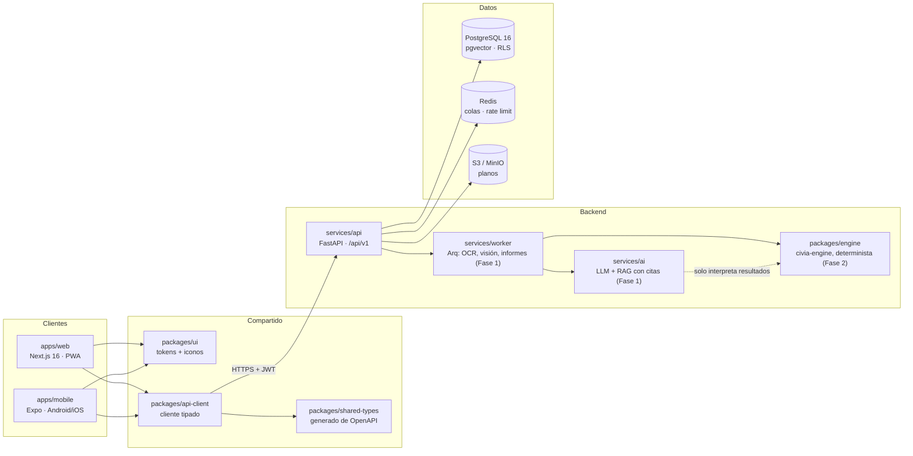
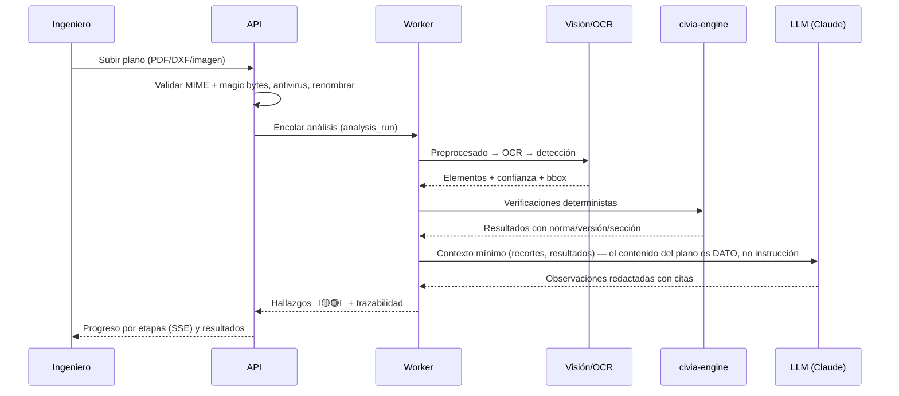

# Arquitectura de CIVIA

## Principio rector

```
IA → interpreta
Motor de ingeniería → calcula (determinista, sin LLM)
Normativa → establece criterios
Ingeniero → valida
```

Ningún cálculo crítico lo hace un LLM. La IA interpreta y redacta; `civia-engine` calcula;
cada resultado guarda la normativa, la versión, las entradas y el usuario (trazabilidad).
Toda salida lleva: *"Requiere revisión y aprobación del profesional responsable."*

## Módulos



| Componente | Estado | Notas |
|---|---|---|
| `services/api` | Fase 0 ✔ | Auth, RBAC, RLS, proyectos, actividad, auditoría |
| `apps/web` | Fase 0 ✔ | Shell completo, login, dashboard, proyectos, perfil, PWA |
| `apps/mobile` | Fase 0 ✔ | Login, biometría, pestañas, proyectos, perfil |
| `packages/ui` | Fase 0 ✔ | Tokens con test de contraste WCAG AA e iconos propios |
| `packages/api-client` / `shared-types` | Fase 0 ✔ | Contrato OpenAPI verificado en CI |
| `services/worker`, `services/ai` | Fase 1 | Análisis de planos, OCR, RAG |
| `packages/engine` | Fase 2 | Cálculo determinista con `pint`, pytest + hypothesis |

## Flujo de IA (diseño, Fase 1)



## Multi-tenant

- Cada petición con datos de una organización envía `X-Organization-Id`.
- La API **valida la membresía primero** (404 si no pertenece) y luego fija
  `app.org_id` / `app.user_id` con `set_config(..., true)` para la transacción.
- PostgreSQL aplica **Row-Level Security** con un rol `civia_app` sin superusuario:
  aunque la aplicación olvidara un filtro, la base de datos no devuelve filas de otra
  organización. Los tests lo comprueban contra Postgres real.

Ver [ER](database/er.md), [modelo de amenazas](security/threat-model.md) y [ADRs](adr/).
